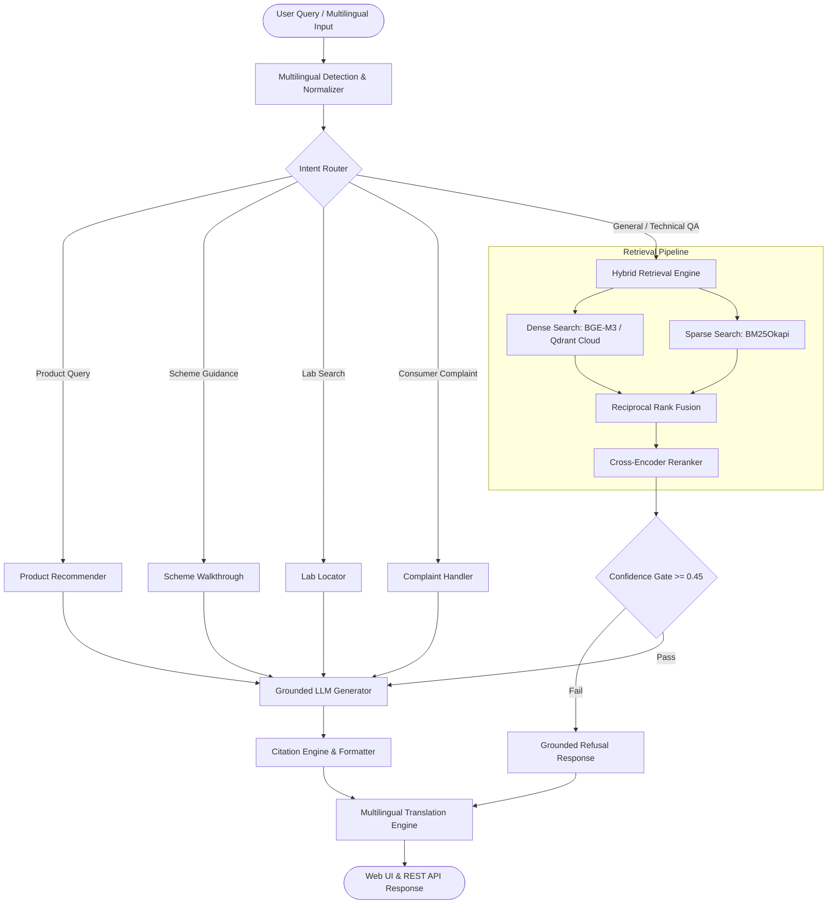

# 🏛️ BIS AI Compliance Assistant — Bureau of Indian Standards RAG System

[](https://www.python.org/downloads/)
[](https://fastapi.tiangolo.com)
[](https://github.com/vinayr00/BIS_RAG)
[](https://github.com/vinayr00/BIS_RAG)
[](https://github.com/vinayr00/BIS_RAG)
[](LICENSE)

An enterprise-grade, multi-lingual **Retrieval-Augmented Generation (RAG) & Compliance Assistant** built for the **Bureau of Indian Standards (BIS)**. It provides end-to-end standard identification, certification walkthroughs, laboratory lookup, consumer grievance handling, and grounded question answering with **0% hallucination** and **100% citation integrity**.

---

## 🌟 Key Capabilities & Features

- **🔍 Hybrid Retrieval Engine (Dense + Sparse + RRF)**:
  - Dense semantic search using `BAAI/bge-m3` embeddings (supporting local store & Qdrant Cloud).
  - Sparse lexical matching with `BM25Okapi` enriched with domain-specific Indian Standard notation preservation (`IS 1786`, `IS:1070:2023`).
  - Reciprocal Rank Fusion (RRF) and Cross-Encoder reranking for top retrieval precision.

- **🛡️ Strict Grounded Generation & Guardrails Refusal Gate**:
  - Context-constrained prompting guaranteeing exact fee schedules (e.g., ₹1,000 application fee, ₹7,000/man-day audit charges) and standard numbers.
  - Confidence-threshold refusal gate (`threshold = 0.45`) to politely decline unsupported queries without guessing.
  - Mandatory clause-level citation badge generation (e.g., `[IS 1786:2018, Cl. 4.2]`, `[QCO-2023]`, `[BIS Act 2016]`).

- **🧭 Intent Routing & Specialized Sub-Flows**:
  - **Product → Standard Recommender**: Instant mapping for commodities (TMT steel, cement, footwear, toys, electronics, gold jewelry, packaged water, etc.).
  - **Certification Scheme Walkthroughs**: Step-by-step application blueprints for ISI Mark (Scheme-I), Compulsory Registration Scheme (CRS, Scheme-II), Foreign Manufacturers Certification Scheme (FMCS), Hallmarking (Scheme-IV), and Eco Mark.
  - **Recognized Laboratory Locator**: Locates nearest central/regional BIS labs with scope and testing capabilities.
  - **Consumer Grievance Redressal**: Guides citizens on filing complaints via BIS CARE App / e-BIS portal, tracking status, and understanding redressal timelines.

- **🌐 Multilingual & Code-Mixed Hinglish Engine**:
  - Native support for **8+ Indic languages**: Hindi (हिंदी), Telugu (తెలుగు), Tamil (தமிழ்), Kannada (ಕನ್ನಡ), Bengali (বাংলা), Marathi (मराठी), Gujarati (ગુજરાતી), and English.
  - Code-mixed Hinglish query normalizer and dialect mapper.
  - Token-masking translation pre-pass ensuring zero citation loss during multilingual synthesis.

- **💻 Modern Interactive Dashboard UI & REST API**:
  - FastAPI async backend serving REST endpoints.
  - Interactive web interface with real-time intent badges, collapsible citation cards, persona quick-selectors, text-to-speech audio synthesis, and feedback capture.

---

## 🏗️ System Architecture


```mermaid
flowchart TD
    User([User Query / Multilingual Input]) --> Preprocess[Multilingual Detection & Normalizer]
    Preprocess --> Router{Intent Router}

    Router -->|Product Query| Sub1[Product Recommender]
    Router -->|Scheme Guidance| Sub2[Scheme Walkthrough]
    Router -->|Lab Search| Sub3[Lab Locator]
    Router -->|Consumer Complaint| Sub4[Complaint Handler]
    Router -->|General / Technical QA| HybridRetriever[Hybrid Retrieval Engine]

    subgraph Retrieval Pipeline
        HybridRetriever --> Dense[Dense Search: BGE-M3 / Qdrant Cloud]
        HybridRetriever --> Sparse[Sparse Search: BM25Okapi]
        Dense --> RRF[Reciprocal Rank Fusion]
        Sparse --> RRF
        RRF --> Rerank[Cross-Encoder Reranker]
    end

    Rerank --> Guardrail{Confidence Gate >= 0.45}
    Guardrail -->|Fail| Refusal[Grounded Refusal Response]
    Guardrail -->|Pass| Generator[Grounded LLM Generator]
    
    Sub1 --> Generator
    Sub2 --> Generator
    Sub3 --> Generator
    Sub4 --> Generator

    Generator --> Citations[Citation Engine & Formatter]
    Citations --> Trans[Multilingual Translation Engine]
    Refusal --> Trans
    Trans --> UI([Web UI & REST API Response])
```

---

## 📂 Modular Project Structure

The repository is organized into clean, focused subpackages:

```
bis_RAG_system/
├── app.py                      # FastAPI Web Application & REST Endpoints
├── run_pipeline.py             # Interactive CLI & Batch Query Runner
├── run.bat                     # 1-Click Windows Launcher for Local Web Server
├── requirements.txt            # Python Dependencies
├── schema.sql                  # Telemetry & Feedback SQLite Database Schema
├── sources.yaml                # Verified BIS Sources & Scraper Configuration
├── sources.example.yaml        # Template Configuration
├── Dockerfile                  # Production Container Specification
├── docker-compose.yml          # Container Orchestration
├── .env.example                # Environment Variable Template
├── .gitignore                  # Git Ignore Rules
├── README.md                   # System Architecture & Documentation
│
├── static/                     # Web Application Assets
│   └── index.html              # Modern Glassmorphic Dashboard Interface
│
├── data/                       # Datasets & Knowledge Base
│   ├── raw/                    # Raw Downloaded PDFs & Scraped JSONs (gitignored)
│   ├── classified/             # Partitioned Ingestion Manifests (Standards, FAQs, etc.)
│   ├── product_standard_map.json # 442+ Curated Product-to-Standard Mappings
│   ├── labs_directory.json     # BIS Recognized Testing Laboratories Database
│   ├── processed_chunks.jsonl  # 55,000+ Grounded Knowledge Base Chunks
│   ├── bis_rag_telemetry.db    # SQLite Telemetry & User Feedback Storage
│   └── vector_index/           # BM25 and Dense Vector Indices
│
├── src/                        # Modular Source Code
│   ├── __init__.py             # Top-level exports and backward compatibility
│   ├── config.py               # Centralized Path Discovery & Configuration Manager
│   │
│   ├── core/                   # Orchestration, Guardrails & LLM Integration
│   │   ├── rag_pipeline.py     # Main BISRAGPipeline orchestrator
│   │   ├── router.py           # Multi-intent classification & routing
│   │   ├── generator.py        # Multi-provider LLM synthesis (Gemini, OpenAI, Anthropic, Groq, Mock)
│   │   ├── guardrails.py       # Uncertainty refusal gate & anti-hallucination checks
│   │   ├── citation_engine.py  # Fact checking & clause badge formatter
│   │   ├── feedback_logger.py  # SQLite telemetry & rating logger
│   │   ├── multilingual.py     # 8+ Indic language detection & dialect normalization
│   │   └── translation_engine.py # Translation engine with token preservation
│   │
│   ├── retrieval/              # Search & Vector Engines
│   │   ├── retrieval.py        # Hybrid BM25 + BGE-M3 Dense Retrieval + RRF
│   │   └── qdrant_retrieval.py # Qdrant Cloud Vector Database integration
│   │
│   ├── services/               # Deterministic Domain Sub-Flows
│   │   ├── product_recommender.py # Standard recommendations & consumer alias expander
│   │   ├── lab_locator.py         # BIS laboratory search by city/state/scope
│   │   ├── scheme_walkthrough.py  # Schemes I, II, IV, XI step-by-step guidance
│   │   └── consumer_complaint.py  # Consumer grievance & portal redressal
│   │
│   ├── ingestion/              # Document Processing & Indexing
│   │   ├── pdf_parser.py       # Layout-aware PDF clause extraction & chunker
│   │   ├── loader.py           # Corpus loading & schema verification
│   │   ├── classifier.py       # Document categorization
│   │   ├── deduplicator.py     # Content-hash deduplication
│   │   ├── metadata.py         # Canonical chunk metadata generator
│   │   ├── validator.py        # Ingestion schema validation
│   │   └── ...
│   │
│   └── scrapers/               # BIS Data Ingestion Harvesters
│       ├── scraper.py          # Base spider for BIS portal
│       ├── api_scraper.py      # BIS public API crawler
│       ├── full_site_scraper.py# Complete website scraper
│       └── download_large_files.py # Batch PDF downloader
│
├── tests/                      # Comprehensive Test Suite
│   ├── test_phase1_verification.py
│   ├── test_phase3.py
│   ├── test_phase4.py
│   ├── test_phase5.py
│   ├── test_retrieval.py
│   ├── test_feedback.py
│   └── test_adversarial.py
│
├── scripts/                    # Maintenance & Cloud Migration Scripts
│   ├── migrate_to_qdrant_cloud.py
│   └── verify_qdrant_cloud_migration.py
│
└── docs/                       # Audit Reports & Evaluation Specifications
    ├── system_evaluation_report.md
    ├── demo_script.md
    └── ...
```

---

## ⚡ Quick Start Guide

### 1. Prerequisites
- Python 3.10, 3.11, or 3.12
- Git

### 2. Installation
```bash
# Clone repository
git clone https://github.com/vinayr00/BIS_RAG.git
cd BIS_RAG

# Create virtual environment
python -m venv .venv

# Activate virtual environment
# Windows:
.venv\Scripts\activate
# Linux/macOS:
source .venv/bin/activate

# Install dependencies
pip install -r requirements.txt
```

### 3. Environment Configuration
Copy the sample environment file:
```bash
cp .env.example .env
```
Edit `.env` with your API keys:
```ini
LLM_PROVIDER=gemini
GEMINI_API_KEY=your_gemini_api_key
# Or OpenAI:
# LLM_PROVIDER=openai
# OPENAI_API_KEY=your_openai_api_key

# Optional Qdrant Cloud integration:
# QDRANT_URL=https://your-qdrant-instance.cloud.qdrant.io:6333
# QDRANT_API_KEY=your_qdrant_api_key
```

### 4. Running the Web Application
Launch the server using the Windows batch script:
```cmd
run.bat
```
Or directly with Python:
```bash
python -m uvicorn app:app --host 127.0.0.1 --port 8000
```
Open [http://127.0.0.1:8000](http://127.0.0.1:8000) in your web browser.

### 5. Interactive CLI
```bash
# Start interactive query loop
python run_pipeline.py --interactive

# Or single query
python run_pipeline.py "What standard applies to TMT steel bars?"
```

---

## 🔌 REST API Reference

| Endpoint | Method | Description | Sample Parameters |
| :--- | :--- | :--- | :--- |
| `/health` | `GET` | Service health check | None |
| `/` | `GET` | Serves Interactive Dashboard | None |
| `/api/chat` | `POST` | Core RAG Compliance QA endpoint | `{"query": "IS 1786 testing requirements", "category": null}` |
| `/api/recommend`| `GET` | Product Standard Recommender | `?query=packaged+drinking+water` |
| `/api/labs` | `GET` | Search BIS Recognized Labs | `?query=cement&state=Maharashtra` |
| `/api/schemes` | `GET` | Certification Scheme Walkthrough | `?scheme=scheme_i` |
| `/api/feedback`| `POST` | Log user rating & feedback | `{"query": "...", "rating": 5, "notes": "Accurate"}` |

---

## 🐳 Docker Deployment

Run with Docker Compose:
```bash
docker-compose up -d --build
```
Check health:
```bash
curl http://localhost:8000/health
```

---

## 🧪 Testing

Run test suite:
```bash
# Run all tests
pytest tests/

# Test standard recommendations
pytest tests/test_phase4.py

# Test multilingual & Hindi queries
pytest tests/test_phase5.py
```

---

## 📄 License
MIT License. Built for the Bureau of Indian Standards (BIS) compliance ecosystem.
